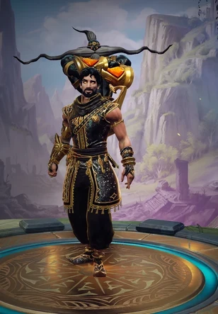
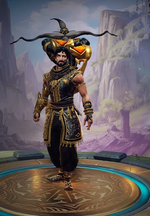
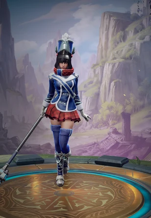
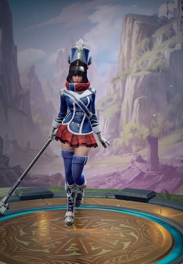
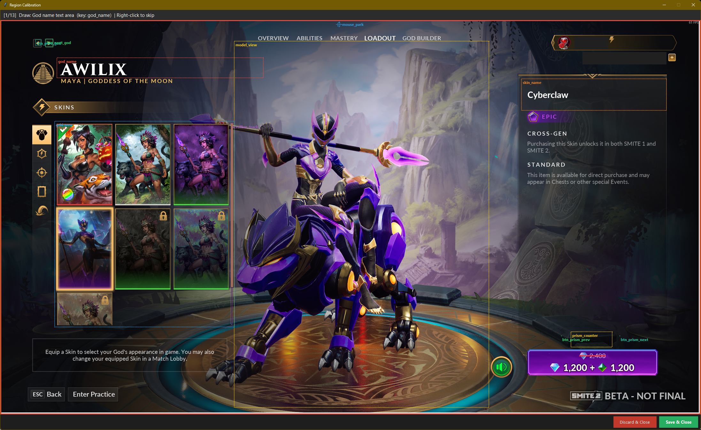

# smite2-skin-screens

Automates capturing skin screenshots and animated previews from Smite 2 for use on the community wiki.

The tool navigates the in-game cosmetics UI, reads god and skin names via OCR, captures the 3D model view as a static WebP and as an animated spin WebP, and writes everything to an `output/` folder with a structured `manifest.json`.

<table>
<tr>
<td></td>
<td></td>
<td></td>
<td></td>
</tr>
</table>

---

## Requirements

- **Windows 10/11** — the tool uses Windows-only APIs (`pywin32`, `ImageGrab`)
- **Smite 2** running in windowed or borderless-windowed mode at your native resolution
- **[uv](https://docs.astral.sh/uv/)** — Python package and script runner
- **[Tesseract OCR](https://github.com/UB-Mannheim/tesseract/wiki)** — native binary for reading god/skin names from the UI

---

## Installation

### 1. Install uv

Follow the [uv installation guide](https://docs.astral.sh/uv/getting-started/installation/).
On Windows with PowerShell:

```powershell
powershell -ExecutionPolicy ByPass -c "irm https://astral.sh/uv/install.ps1 | iex"
```

### 2. Install Tesseract OCR

1. Download the latest `tesseract-ocr-w64-setup-*.exe` from the [UB Mannheim builds](https://github.com/UB-Mannheim/tesseract/wiki)
2. Run the installer — use the default path `C:\Program Files\Tesseract-OCR`
3. Add Tesseract to your PATH:
   - Open Start → search **"Edit the system environment variables"**
   - Click **Environment Variables** → under *System variables* select `Path` → **Edit**
   - Add `C:\Program Files\Tesseract-OCR`
   - Click OK and restart your terminal

If you install to a different path, update `tesseract_path` in `config.yaml`.

### 3. Verify dependencies

Python packages are declared inline in each script (PEP 723) and installed automatically by `uv run`. To do a quick sanity check:

```bash
uv run check_deps.py
```

---

## Setup & Calibration

Calibration teaches the tool where each UI element is on your screen. It must be done once per resolution or after any UI layout change.

### Step 1: Prepare the game

1. Launch Smite 2
2. Open the **God** tab → **Skins** page for any god that has at least one skin with prism recolors (e.g. Achilles → Soul Piercer)
3. Leave the game in the foreground

### Step 2: Run the calibration tool

```bash
uv run calibrate.py
```

The tool focuses the game window, takes a full-screen screenshot, and opens a calibration window that fills your screen.



**Controls:**
- **Left-drag** — draw a rectangle around the region
- **Left-click** — set a single point (for the mouse park position)
- **Right-click** — skip the current region (keeps the existing value from `config.yaml`)

You will be prompted to define these regions in order:

| Region | What to draw |
|---|---|
| `god_name` | The text area showing the god's name |
| `skin_name` | The skin name / details panel (updates when a card is clicked) |
| `model_view` | The 3D model display — the area you want captured in screenshots |
| `btn_next_god` | The "next god" arrow button |
| `btn_prev_god` | The "previous god" arrow button |
| `grid_area` | The entire scrollable skin card grid container |
| `scrollbar_track` | The thin vertical scrollbar strip on the right edge of the grid |
| `first_card` | The top-left card in the grid — used to determine card size |
| `_second_card` | The card immediately to the **right** of the first — used to compute the gap between cards |
| `prism_counter` | The `X / Y` counter text between the ◄ ► arrows at the bottom of the skin panel |
| `btn_prism_prev` | The ◄ (previous prism) button |
| `btn_prism_next` | The ► (next prism) button |
| `mouse_park` | A **single click** anywhere outside the model view — the cursor hides here during captures to avoid UI hover effects |

All results are saved to `config.yaml` automatically when you close the window. For `btn_prism_prev` and `btn_prism_next`, a grayscale template image (`btn_prism_prev_template.png` / `btn_prism_next_template.png`) is also saved alongside `config.yaml`. At runtime the tool uses template matching to find the exact button position each time it needs to click, so minor UI drift (the prism buttons shift up or down slightly depending on the skin) is handled automatically without recalibration.

**Tips:**
- Draw regions slightly tight rather than loose — OCR accuracy improves when the text region is clean
- For `scrollbar_track`, draw the full-height track including the thumb; it can be very thin (a few pixels wide)
- For `prism_counter`, `btn_prism_prev`, `btn_prism_next` — click a skin that has prism recolors before calibrating so the prism UI is visible. Right-click to skip these if no prism skin is visible and come back later
- For `mouse_park`, click somewhere in the top-right corner of the screen outside the capture area (e.g. the desktop area above the game UI)

### Step 3: Calibrate the spin animation

The spin animation drag distance and duration need to match so the model completes exactly one full rotation.

```bash
uv run calibrate.py --spin
```

This opens an interactive loop:

```
Commands:  t=test   p=set drag_px   d=set duration   s=save & quit   q=quit
```

- `t` — performs the drag on the game model and shows a before/after comparison. If the model looks the same in both frames, the rotation is exactly 360°
- `p` — change `drag_px` (larger = more rotation)
- `d` — change `duration` (the drag takes exactly this many seconds; don't change unless needed)
- `s` — save current values to `config.yaml` and exit

The calibrated values (`spin_drag_px`, `spin_duration_s`) are saved to `config.yaml`.

---

## Running

Navigate to a god's skin screen in-game, then:

```
usage: screenshotter.py [-h] [--all-gods] [--no-spin] [--dry-run]

Capture skin screenshots and animations from Smite 2.

options:
  -h, --help   show this help message and exit
  --all-gods   Iterate the full god roster automatically
  --no-spin    Skip animated WebP captures (static screenshots only)
  --dry-run    Print what would be saved without writing any files
```

Flags can be combined freely, e.g. `uv run screenshotter.py --all-gods --no-spin`.

---

## Output

All files are written to `output/`:

```
output/
  manifest.json              ← structured index of all captured skins
  achilles-achilles.webp     ← static screenshot
  achilles-achilles-spin.webp  ← animated 360° spin
  achilles-soul-piercer.webp
  achilles-soul-piercer-spin.webp
  achilles-soul-piercer-veil-strider.webp       ← prism recolor
  achilles-soul-piercer-veil-strider-spin.webp
  ...
```

Filenames use URL-safe slugs: `{god-slug}-{skin-slug}.webp`. Prism recolors append the recolor name: `{god}-{skin}-{recolor}.webp`.

Runs are **resumable** — if a file already exists it is skipped. The manifest is merged, not overwritten, so you can run `--all-gods` multiple times and only new skins will be captured.

### manifest.json structure

```json
{
  "meta": { "tool": "s2-skin-screenshotter", "created": "...", "last_updated": "..." },
  "gods": {
    "achilles": {
      "skins": {
        "achilles-achilles": {
          "name": "Achilles",
          "file": "achilles-achilles.webp",
          "spin_file": "achilles-achilles-spin.webp",
          "prisms": {}
        },
        "achilles-soul-piercer": {
          "name": "Soul Piercer",
          "file": "achilles-soul-piercer.webp",
          "spin_file": "achilles-soul-piercer-spin.webp",
          "prisms": {
            "achilles-soul-piercer-veil-strider": {
              "name": "Soul Piercer - Veil Strider",
              "index": 1,
              "file": "achilles-soul-piercer-veil-strider.webp",
              "spin_file": "achilles-soul-piercer-veil-strider-spin.webp"
            }
          }
        }
      }
    }
  }
}
```

All keys (gods, skins, prisms) are slugs matching the filenames, making it easy to look up files without string manipulation.

---

## Interrupting a run

If you need to stop a run mid-way:

1. **Alt+Tab** back to the terminal
2. Press **Ctrl+C**

The tool will:
- Delete any partial files for the skin that was currently being processed (static + spin WebP)
- **Not** update the manifest for the interrupted skin
- Print a clean `Stopped.` message — no stack trace

The next time you run, the interrupted skin will be detected as missing and captured from scratch.

---

## Timing

The terminal shows elapsed time throughout the run:

```
God 3: Aphrodite  (total elapsed: 12m 34s)
  saved aphrodite-aphrodite.webp
  saved aphrodite-aphrodite-spin.webp
  ...
Done. saved=18 skipped=0  (8m 02s)
  → Aphrodite finished in 8m 02s
```

Per-god time appears after each god completes. Total elapsed appears in each god header and in the final summary.

---

## Tuning

Key values in `config.yaml`:

| Key | Default | Description |
|---|---|---|
| `delays.before_screenshot` | `3.0` | Seconds to wait after selecting a skin before capturing — lets the 3D model fully load |
| `delays.after_skin_select` | `0.5` | Pause after clicking a skin card |
| `delays.after_god_select` | `1.5` | Pause after clicking next/prev god |
| `spin_drag_px` | `372` | Horizontal drag distance for one 360° rotation |
| `spin_duration_s` | `3.0` | Duration of the drag in seconds |
| `spin_still_s` | `2.0` | Seconds of still frames at the front pose before the spin |
| `spin_fps` | `15` | Frame rate for animated WebP capture |
| `spin_scale` | `0.33` | Scale factor for animated WebP frames (reduces file size) |
| `webp_quality` | `90` | WebP lossy quality for both static and animated output |
| `template_search_margin` | `60` | Pixels to expand the search area around a button's calibrated position when template matching |
| `template_match_threshold` | `0.7` | Minimum match confidence (0–1) — below this the calibrated center is used as fallback |

---

## Copyright

All game assets, images, and content captured by this tool are the property of **Hi-Rez Studios** and **Smite 2**. This tool is a fan-made utility for the community wiki and is not affiliated with or endorsed by Hi-Rez Studios. Screenshots are used under fair use for non-commercial, informational purposes.
